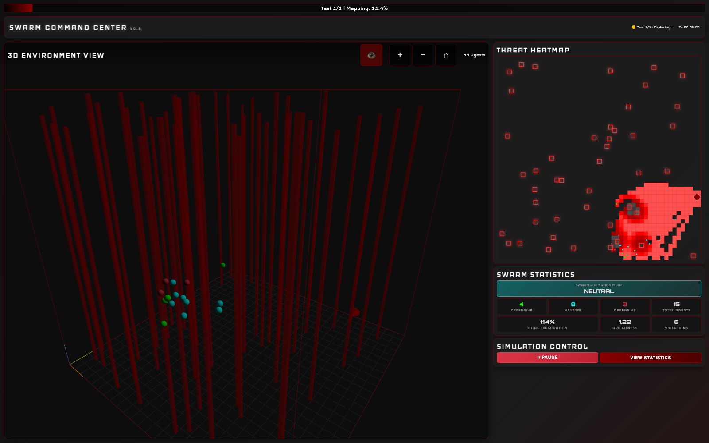
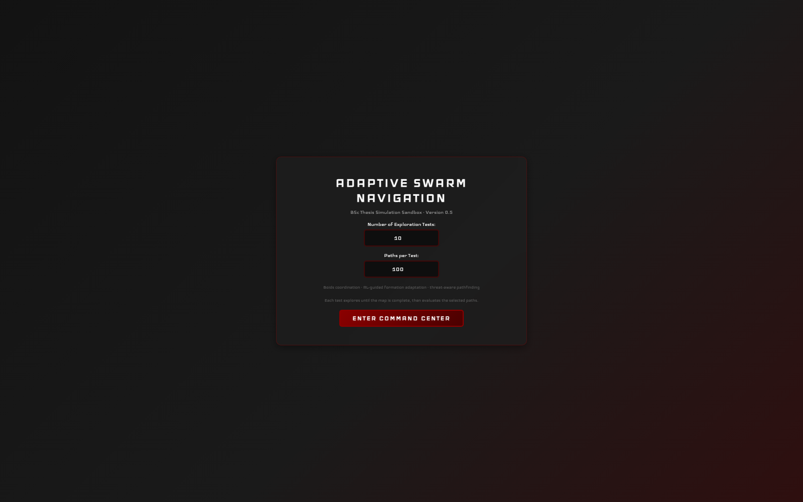

# Adaptive Swarm Navigation with Reinforcement Learning

This repository brings together my BSc thesis, the version 0.5 simulation sandbox, and the experiment data behind the project. The work was completed at the Department of Computer Science and Telecommunications, University of Thessaly, under the supervision of Associate Professor Konstantinos Kolomvatsos.

<p align="center">
  <a href="https://ir.lib.uth.gr/xmlui/"></a>
  
  
  <a href="LICENSE"></a>
  <a href="LICENSE-CONTENT.md"></a>
</p>

<p align="center">
  <a href="#run-it-locally">Run the sandbox</a> ·
  <a href="docs/architecture.md">Architecture</a> ·
  <a href="data/README.md">Experiment data</a> ·
  <a href="docs/reproducibility.md">Reproducibility</a> ·
  <a href="#citation">Citation</a>
</p>

The idea came from the way natural groups, such as flocks of birds and schools of fish, react to uncertainty using local perception rather than a single central controller. I wanted to explore how the same principle could help artificial agents move together, respond to changing threat levels, and decide when safety matters more than speed.

The result is a decentralized swarm that explores an initially unknown 3D environment, changes formation as conditions change, and then plans routes through the map it has discovered. Reinforcement learning is used to adapt the swarm's behavior; it does not replace the local Boids interactions that produce the collective motion.

> The PDF is not hosted in this repository. To read the complete thesis, visit the [University of Thessaly Institutional Repository](https://ir.lib.uth.gr/xmlui/) and search for **“Adaptive swarm navigation with the use of reinforcement learning”** or **Athanasios Koukousias**.



## What I built

The simulation runs in two main stages. First, the agents explore and gradually build a picture of the environment from limited local information. Once enough of the space has been mapped, the same environment is used to compare navigation strategies.

The main parts are:

1. **Local swarm movement** - an extended Boids model combines cohesion, alignment, separation, exploration, and obstacle avoidance.
2. **Formation changes** - the agents move between Offensive, Neutral, and Defensive behavior according to the threat they perceive.
3. **Learned adaptation** - tabular Q-learning adjusts the interaction parameters so the swarm can balance coverage, safety, and stability over time.
4. **Path planning after exploration** - Dijkstra, A*, Safety First, and my Balanced Navigation approach are evaluated on the discovered map.

For the experiments I used 15 agents in a bounded 500 × 500 × 500 space with 45 static obstacles. The result file included here contains **4,000 profile-level runs**, built from 1,000 start-goal tasks across 10 randomized tests.

| Algorithm | Success rate | Mean path cost | Mean path length |
| --- | ---: | ---: | ---: |
| Dijkstra | 100.0% | 35.476 | 24.05 |
| A* | 100.0% | 35.598 | 24.07 |
| Safety First | 99.9% | 29.297 | 33.34 |
| **Balanced Navigation** | **100.0%** | **9.525** | 26.01 |

These numbers come directly from [`data/pathfinding-experiments.csv`](data/pathfinding-experiments.csv). Dijkstra and A* usually found the shortest geometric routes, while Safety First accepted much longer routes to avoid danger. Balanced Navigation sat between them in path length but achieved the lowest weighted traversal cost in this batch. That trade-off between distance and environmental risk is the point of the proposed method.

This is one archived experimental batch, not a claim that the same numbers will hold in every environment. The thesis explains the setup, metrics, and limitations in more detail.

## How the swarm changes formation

I represent formations as parameter profiles rather than fixed geometric shapes. Each profile changes the balance between separation, alignment, and cohesion, so the swarm can respond without giving up its decentralized behavior.

| Profile | Environmental cue | Collective behavior | Primary objective |
| --- | --- | --- | --- |
| **Offensive** | Low threat, high opportunity | The swarm spreads out while keeping enough alignment to move together | Faster exploration and target engagement |
| **Neutral** | Moderate threat | Cohesion, alignment, and separation stay balanced | Flexible, general-purpose movement |
| **Defensive** | High threat | Agents pull closer and move more conservatively | Protect the swarm and preserve stability |
| **Dynamic** | Conditions change during the mission | The active profile follows the local threat level | Balance exploration and survivability |

## What you can see in the sandbox

The browser view is connected to the running simulation, so it shows the research process rather than a prerecorded animation. You can:

- follow the agents and obstacles in the 3D environment;
- watch the explored area and threat field develop on the 2D map;
- see how many agents are currently behaving Offensively, Neutrally, or Defensively;
- monitor fitness, exploration progress, and constraint violations;
- choose start and goal points and compare all four routes;
- run randomized experiment batches and download the results.

<table>
  <tr>
    <td width="50%"></td>
    <td width="50%"></td>
  </tr>
  <tr>
    <td align="center"><sub>Choose the evaluation scale</sub></td>
    <td align="center"><sub>Observe exploration and adaptive formation behavior</sub></td>
  </tr>
</table>

## Run it locally

You need Python 3.11 or newer and a current desktop browser. The interface loads Three.js, Chart.js, and its fonts from public CDNs, so the first browser load also needs an internet connection.

```bash
git clone <your-new-repository-url>
cd Swarm-Thesis

python3 -m venv .venv
source .venv/bin/activate          # Windows: .venv\Scripts\activate
python -m pip install -r requirements.txt
python simulation/app.py
```

Open [http://127.0.0.1:5000](http://127.0.0.1:5000), choose the number of randomized tests and paths per test, then enter the command center.

Useful environment variables:

| Variable | Default | Purpose |
| --- | --- | --- |
| `SWARM_HOST` | `127.0.0.1` | Bind address |
| `SWARM_PORT` | `5000` | HTTP port |
| `SWARM_DEBUG` | `0` | Set to `1` for Flask debug mode |
| `SWARM_BACKGROUND_SIMULATION` | `1` | Set to `0` when embedding or testing |

## Run the checks

The smoke tests import the simulation, render the main page, initialize a world, advance the swarm, and make sure all four pathfinders return usable results.

```bash
python -m unittest discover -s tests -v
```

The same command runs in GitHub Actions on Python 3.11 and 3.12. A fast syntax check is also available with `python -m compileall -q simulation tests`.

## Project layout

```text
.
├── simulation/                  # Flask API, swarm model, planning, and web UI
├── tests/                       # Deterministic application smoke tests
├── data/                        # Archived aggregate pathfinding results
├── docs/
│   ├── thesis/                  # Library access and citation guidance
│   ├── reference/               # Equations, parameters, metrics, RL notes
│   ├── architecture.md          # Component and request-flow overview
│   └── reproducibility.md       # Provenance and repeatability notes
├── assets/                      # Screenshots from the running simulator
└── .github/workflows/           # Continuous smoke-test workflow
```

## What the thesis covers

The written thesis starts with the ideas behind collective behavior and then moves toward the simulator, learning process, and evaluation:

- **Chapter 1 - Introduction**: motivation, optimal-position scouting, and research scope.
- **Chapter 2 - Fundamentals of swarm behavior**: biological collectives, Boids, robotics, and reinforcement learning.
- **Chapter 3 - System model and environment**: 3D domain, agent state, sensing, motion, obstacles, threat, and opportunity fields.
- **Chapter 4 - Formation and navigation strategy**: formation classification, environmental adaptation, exploration, and Balanced Navigation.
- **Chapter 5 - Reinforcement learning framework**: MDP formulation, policy design, and tabular training process.
- **Chapter 6 - Results and discussion**: profile evaluation and pathfinding comparison.
- **Chapter 7 - Conclusion and future improvements**: limitations, dynamic environments, multi-agent RL, and physical deployment.

## Where the work can go next

This is still a simulation, not flight-control software. Obstacles are static, sensing and localization are simplified, and communication between agents is assumed to be reliable. A real deployment would have to deal with moving hazards, sensor noise, uncertain position estimates, different types of agents, limited energy, and communication delays.

The next steps I identify in the thesis are richer dynamic environments, deep or multi-agent reinforcement learning, larger swarms, continuous action spaces, and eventually testing the approach on physical robots.

## Citation

GitHub can generate a software citation from [`CITATION.cff`](CITATION.cff). For the academic work, use:

> Koukousias, A. (2026). *Adaptive swarm navigation with the use of reinforcement learning* [Bachelor's thesis, University of Thessaly].

BibTeX and licensing guidance for the document are available in [`docs/thesis/README.md`](docs/thesis/README.md).

## Licensing

- Source code in `simulation/`, `tests/`, and `.github/` is released under the [MIT License](LICENSE).
- Original repository documentation and media are released under [CC BY 4.0](LICENSE-CONTENT.md), except where third-party material is separately credited.
- The imported simulator provenance is recorded in [NOTICE](NOTICE).

Please cite the thesis when this artifact contributes to academic work.
