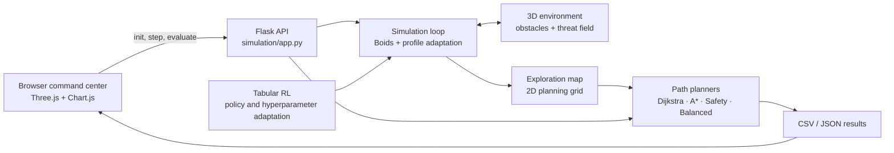

# How the simulator is put together

## Python research API (v0.6)

`src/swarm_nav/` provides an importable library over the shared thesis algorithms.
Its public interface is documented in [Python research API](python-api.md).

```text
Research script / notebook
  ├── build_environment → Environment + exploration map
  ├── generate_obstacles → Obstacle objects → Environment.add_obstacles
  ├── deploy_swarm      → Swarm + independent agents
  └── Simulation
        ├── ProfilePolicy.select → per-agent movement profile
        ├── Dynamics.advance     → one movement tick
        ├── map updates          → discovered cells
        └── snapshot / save      → metrics and run artifacts

ThesisPlanner.plan → existing XY planner + isolated profile settings
```

Configuration lives in frozen dataclasses. Each environment owns independent
obstacle and deployment random streams; agents own their learning random streams.
The library imports the existing `Agent`, exploration map, Boids functions, and
planner implementations through the `simulation` package. It does not import
`simulation/app.py`. The browser remains on its existing workflow, and the Python
API can be used without Flask installed. No REST run registry or server migration
is required to run a research script.

## Browser sandbox (v0.5)

I kept version 0.5 fairly small. Python holds the world state and performs the swarm, learning, and pathfinding calculations. The browser turns that state into the live command-center view and starts the experiment cycles.



## Component map

| Component | Responsibility |
| --- | --- |
| `simulation/app.py` | Keeps the shared simulation state and connects it to the browser through Flask routes. |
| `simulation/agent.py` | Describes one agent: its position, movement, sensing, active profile, and fitness. |
| `simulation/environment.py` | Holds the world boundaries and calculates how obstacles influence movement. |
| `simulation/exploration_map.py` | Records what the swarm has discovered and builds the threat map used later for navigation. |
| `simulation/profiles.py` | Stores the Offensive, Neutral, and Defensive movement and fitness settings. |
| `simulation/utils.py` | Contains the Boids rules, profile switching, shared parameters, and swarm-level measurements. |
| `simulation/pathfinding.py` | Implements Dijkstra, A*, Safety First, and Balanced Navigation. |
| `simulation/experiments.py` | Runs repeated planner/profile comparisons and the tabular learning evaluation. |
| `simulation/templates/index.html` | Defines the command-center layout and visual style. |
| `simulation/static/js/main.js` | Draws the 3D scene and heatmap, handles the controls, and requests updates from Flask. |

## Runtime flow

1. The browser calls `/init`. This creates the bounded environment, random obstacles, threat field, nest, and 15 starting agents.
2. Every simulation step reads the local threat around each agent, chooses the matching profile, applies the Boids and environmental forces, moves the agents, and records newly explored cells.
3. The browser receives the updated positions, obstacle geometry, map cells, threat values, formation counts, and exploration progress.
4. After the exploration stage, the experiment code samples start-goal pairs and runs all four planners under Offensive, Neutral, Defensive, and Dynamic conditions.
5. The results can be inspected in the command center or exported for separate analysis.

## Formation adaptation

The swarm does not jump between rigid shapes. Instead, each formation is a set of parameters that changes separation, alignment, cohesion, and the way fitness is measured. Low threat allows the agents to spread out and explore; high threat pulls them into a tighter, more cautious group.

The learning layer adjusts these interaction settings from experience. It guides the collective behavior without issuing a centralized trajectory to every agent, which lets the emergent character of the Boids model remain intact.

## Planning strategies

| Planner | Cost emphasis | Expected behavior |
| --- | --- | --- |
| Dijkstra | Path cost plus a moderate threat term | Exhaustive, formation-aware shortest route |
| A* | Same cost with a goal-directed heuristic | Similar route quality with focused search |
| Safety First | Dominant threat penalty | Long detours when they reduce exposure |
| Balanced Navigation | Joint distance and safety term | Moderate path length with lower total traversal cost |

## HTTP surface

The main endpoints used by the browser and smoke suite are:

| Method | Endpoint | Purpose |
| --- | --- | --- |
| `GET` | `/health` | Lightweight readiness and version response |
| `GET` | `/` | Render the command center |
| `POST` | `/init` | Reset the randomized world and swarm |
| `GET` | `/step` | Advance and serialize one simulation step |
| `POST` | `/pathfinding` | Compare four routes for one start-goal pair |
| `GET` | `/optimal_position` | Return the lowest-threat discovered position |
| `POST` | `/run_experiments` | Start a batch evaluation |
| `GET` | `/experiment_progress` | Report batch progress |
| `GET` | `/fitness_statistics` | Report aggregate swarm fitness and violations |

The application is meant for one local research session at a time. `SimulationState` lives in the Python process, so this is not intended to be a multi-user service or a persistent experiment queue.
